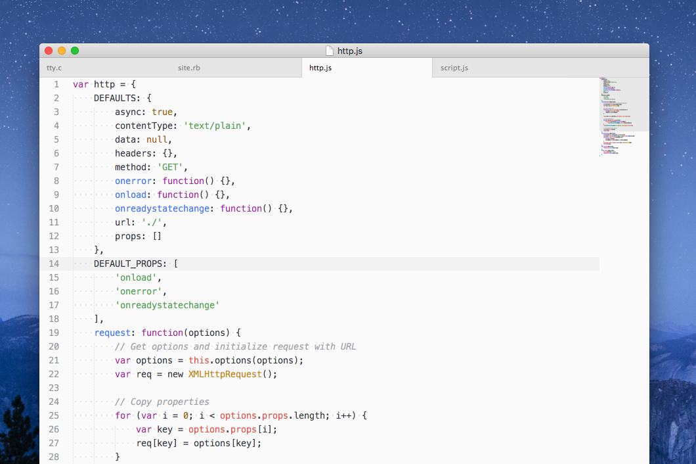

### one

One Light Atom theme, ported to Sublime Text.

---

#### Sublime UI theme

> **Warning**: The UI theme, although usable, is still a work in progress and therefore incomplete at the moment.

The UI theme (from Atom's [One Light UI](https://github.com/atom/one-light-ui) is contained in the `One Light.sublime-theme` file. Be sure you have a copy of the `One/` directory as well, since this contains the image resources used in the theme.

#### Syntax theme

`One Light.tmTheme` contains a port of Atom's [One Light syntax](https://github.com/atom/one-light-syntax) theme, to match the UI. It features the full TextMate set from Atom's syntax CSS, which means it has extensive support for language features.

#### JavaScript A syntax

Unsatisfied with Sublime's built-in JavaScript syntax definition, I also created an improved version, `JavaScript A`, based on Atom's [JavaScript language pack](https://github.com/atom/language-javascript). A screenshot comparing the native JavaScript syntax and `JavaScript A` can be found [here](Screenshots/JS%20Comparison.png).

---

#### Preliminary installation instructions

If you just want to try the theme out right now, here's how to do it (keep in mind that this isn't a finished package yet, and things will look broken sometimes!):

1. Clone the repository (or download a zip) into `Packages/One`
2. Download or clone [kkga/spacegray](https://github.com/kkga/spacegray) (to use the icons from that theme, since I don't have any yet), and copy the `Spacegray/Spacegray` directory to `Packages/One/Spacegray`
3. Set `"theme": "One Light.sublime-theme",` in your preferences JSON file
